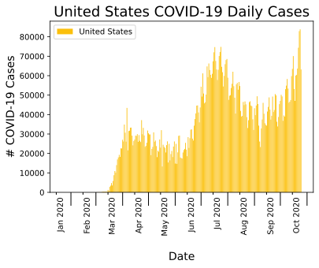
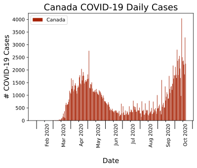
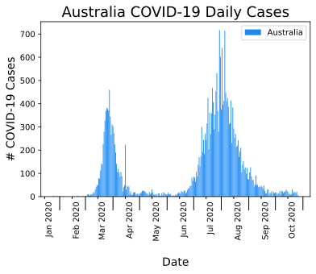
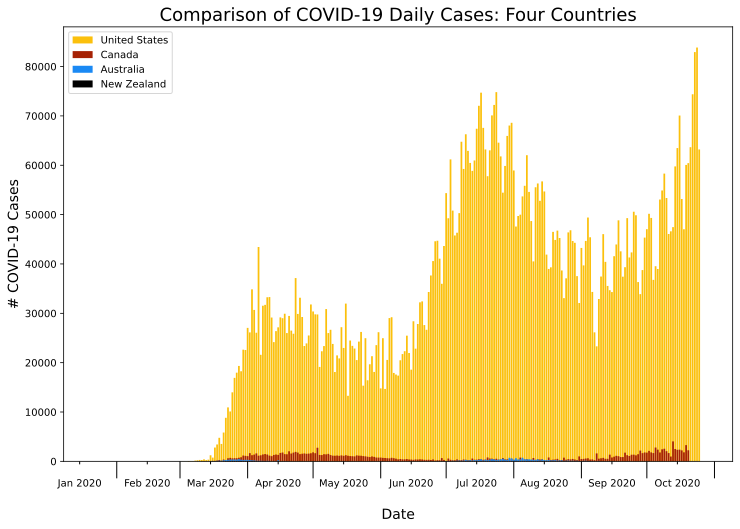
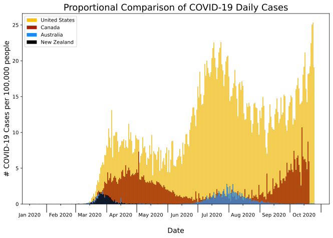
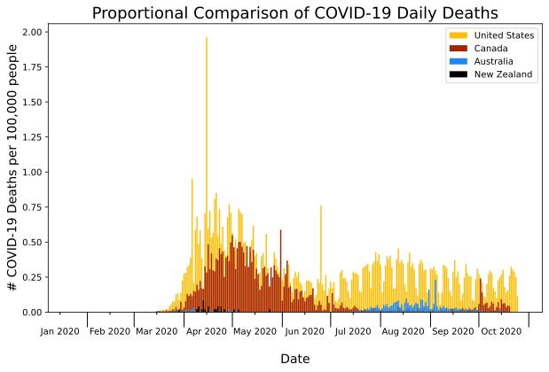

# Capstone_1
# Project Question/Goal
go with purpose: if the us had public health like Canada, Aus, NZ, would we have done better with managing the pandemic?  

# Background + Motivation

# Raw Data + Data Cleaning
show list of columns & datatype --> so that way can show what I paired it down to
(might take away more columns again)
link to sources for data, how many data points (rows) etc

# Exploratory Data Analysis

After creating cleaned dataframes for each country, I started exploring the data by looking at  daily case incidence of COVID-19 over the past ten months of the pandemic for each country. 
  
|                              |                                  |
| ---------------------------- | -------------------------------- |
|||
|                              |                                  |
||   |

Upon initial analysis of the y-axis (# of COVID-19 cases), it was clear the United States has had an overwhelmingly larger amount of COVID-19 cases compared to Canada, Australia and New Zealand.  
   
To better visualize the direct comparisons, I plotted the four countries together. Due to the United States' highest daily count around 80,000 cases, however, it was hard to see the other three countries' data on the plot. 

  

 *Fig 1: Comparing United States, Canada, Australia + New Zealand daily incidence of COVID-19 cases; major ticks are beginning and end of each month, minor ticks are the 15th of each month.*   

To be able to better compare the four countries, I created a new column in my merged dataframe with the value of daily cases per 100,000 people in each country (a weighted daily cases value). Shown below, with the new proportional data we can see more of each county's results; however, the United States is still far worse off on handling the pandemic compared to Canada, Australia and New Zealand. 

  

*Fig 2: Comparing United States, Canada, Australia + New Zealand daily incidence of COVID-19 cases per 100,000 people; major ticks are beginning and end of each month, minor ticks are the 15th of each month.*   

Next, I wanted to compare the deaths due to COVID-19 in the four countries. Again, I created a merged dataframe with proportional columns of daily deaths per 100,000 people for each country.  

 
*Fig 3: Comparing United States, Canada, Australia + New Zealand daily death count due to COVID-19 per 100,000 people; major ticks are beginning and end of each month, minor ticks are the 15th of each month.*   

Based on the plots, the daily number of deaths was more comparable at the first wave of the pandemic between the US and Canada; however, the US still looks to have had more deaths proportionally compared to the other three countries. The following two tables show the total number of COVID-19 cases and deaths for each country, along with the weighted total for each country.  

  

| **Country**        | **Total # COVID-19 Cases** | **Total # COVID-19 Cases per 100,000 people**|
| :----------------: | :------------------------: | :------------------------------------------: |
|   United States    |          8,617,022         |                     2603.3                   |
|       Canada       |            203,688         |                      539.7                   |
|     Australia      |             27,527         |                      107.9                   |
|    New Zealand     |              1,154         |                       23.9                   |
   

  

  

| **Country**        | **Total # COVID-19 Deaths** | **Total # COVID-19 Deaths per 100,000 people**|
| :----------------: | :------------------------: | :------------------------------------------: |
|   United States    |          224601        |                     67.85                  |
|       Canada       |            9793       |                      25.95                  |
|     Australia      |             905         |                      3.55                  |
|    New Zealand     |              22        |                       0.46                  |
   

  

# Analysis

Has the United States handled the pandemic poorly compared to Canada, Australia and New Zealand?  
 
I performed a hypothesis test utilizing the two sample approximate test of population frequencies to test whether someone is more likely to die from COVID-19 in the US compared to "x" country.  
>  H0 : Frequency of dying due to COVID-19 in US &le; Frequency of dying due to COVID-19 in "x" country  
> Ha : Frequency of dying due to COVID-19 in "x" country > Frequency of dying due to COVID-19 in US  

| **Country**        | **Frequency of Death due to COVID-19 per 100,000 people** | **Total # COVID-19 Cases per 100,000 [through 10/12/2020]**| **Total # Deaths due to COVID-19 per 100,000 people [through 10/26/20]** |
| :----------------: | :------------------------: | :------------------------------------------: | :--------: |
|   United States    |          0.029        |                     2352.7                   |      67.85     |
|       Canada       |           0.054     |                      484.4                  |          25.95 |
|     Australia      |             0.033        |                      107.0                   |     3.55   |
|    New Zealand     |              0.019       |                       23.9                   |      0.46    |

# Future Steps

# References
