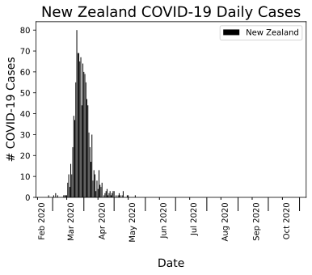
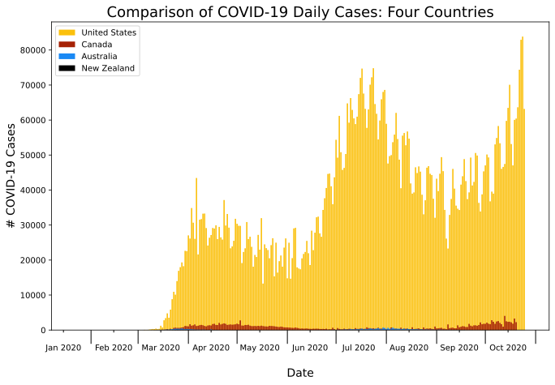

# Capstone_1
# Project Question/Goal
go with purpose: if the us had public health like Canada, Aus, NZ, would we have done better with managing the pandemic?  

# Background + Motivation

# Raw Data + Data Cleaning  

The initial data for all four countries was obtained from multiple sources, then cleaned into new datasets and two merged datasets.  

**Initial Data**
| United States Data | Canada Data | Australia Data | New Zealand Data |
| : ----- : | : ----- : | : -------- : | : ------ : |
| 15 Columns |  31 Columns   | 17 Columns | 10 Columns |  
| 16681 Rows | 3418 Rows | 277 Rows  |  4886 Rows | 
| Split up by States by Date | Split up by Province By Date  | Split up by Date  | Split up by Region by Date  |
| Retained 10 coulmns in cleaned dataframe |  Retained 11 columns | Retained all 17 columns  | Retained all 10 columns  |

# Exploratory Data Analysis

After creating cleaned dataframes, I started exploring the data by looking at  daily case incidence of COVID-19 over the past ten months of the pandemic for each country. 
  
|                              |                                  |
| ---------------------------- | -------------------------------- |
|||
|                              |                                  |
||   |

Upon initial analysis of the y-axis (# of COVID-19 cases), it was clear the United States has had an overwhelmingly larger amount of COVID-19 cases compared to Canada, Australia and New Zealand.    

To better visualize the direct comparisons, I plotted the four countries together. Due to the United States' highest daily count around 80,000 cases, however, it was hard to see the other three countries' data on the plot. 

   
 *Fig 1: Comparing United States, Canada, Australia + New Zealand daily incidence of COVID-19 cases; major ticks are beginning and end of each month, minor ticks are the 15th of each month.*   

To be able to better compare the four countries, I created a new column in my merged dataframe with the value of daily cases per 100,000 people in each country (a weighted daily cases value). Shown below, with the new proportional data we can see more of each county's results; however, the United States is still far worse off on handling the pandemic compared to Canada, Australia and New Zealand. 

   
*Fig 2: Comparing United States, Canada, Australia + New Zealand daily incidence of COVID-19 cases per 100,000 people; major ticks are beginning and end of each month, minor ticks are the 15th of each month.*   

Next, I wanted to compare the deaths due to COVID-19 in the four countries. Again, I created a merged dataframe with proportional columns of daily deaths per 100,000 people for each country.  

   
*Fig 3: Comparing United States, Canada, Australia + New Zealand daily death count due to COVID-19 per 100,000 people; major ticks are beginning and end of each month, minor ticks are the 15th of each month.*   

Based on the plots, the daily number of deaths was more comparable at the first wave of the pandemic between at least the US and Canada; however, the US still looks to have had more deaths proportionally compared to the other three countries. This is shown in the following two tables that show the total number of COVID-19 cases and deaths for each country, along with the weighted total for each country.  

  

| **Country**        | **Total # COVID-19 Cases** | **Total # COVID-19 Cases per 100,000 people**|
| :----------------: | :------------------------: | :------------------------------------------: |
|   United States    |          8,617,022         |                     2603.3                   |
|       Canada       |            203,688         |                      539.7                   |
|     Australia      |             27,527         |                      107.9                   |
|    New Zealand     |              1,154         |                       23.9                   |
   

  

  

| **Country**        | **Total # COVID-19 Deaths** | **Total # COVID-19 Deaths per 100,000 people**|
| :----------------: | :------------------------: | :------------------------------------------: |
|   United States    |          224601        |                     67.85                  |
|       Canada       |            9793       |                      25.95                  |
|     Australia      |             905         |                      3.55                  |
|    New Zealand     |              22        |                       0.46                  |
   

  

# Analysis

Has the United States handled the pandemic poorly compared to Canada, Australia and New Zealand?  
 
I performed a hypothesis test test whether someone is more likely to die from a COVID-19 infection in the United States compared to "x" country.  
>  H0 : Probability of dying due to COVID-19 in US &le; Probability of dying due to COVID-19 in "x" country  
> Ha : Probability of dying due to COVID-19 in US > Probability of dying due to COVID-19 in "x" country   

Due to the p-values from each test with &alpha; = 0.10, I was not able to reject the null hypothesis; thus, I could not conclude that there is a significant difference in the probability of dying due to COVID-19 between the United States and Canada, Australia, or New Zealand.   
> p-value for H0 US Probability &le; Canada Probability: 0.997   
> p-value for H0 US Probability &le; Australia Probability: 0.603   
> p-value for H0 US Probability &le; New Zealand Probability: 0.388    

Even though the plot made it look like the death rate was much worse in the United States, this conclusion makes sense when you look at the proportional frequency of death for each country as they are very close to each other.

| **Country**        | **Frequency of Death due to COVID-19 per 100,000 people** | **Total # COVID-19 Cases per 100,000 [through 10/12/2020]**| **Total # Deaths due to COVID-19 per 100,000 people [through 10/26/20]** |
| :----------------: | :------------------------: | :------------------------------------------: | :--------: |
|   United States    |          0.029        |                     2352.7                   |      67.85     |
|       Canada       |           0.054     |                      484.4                  |          25.95 |
|     Australia      |             0.033        |                      107.0                   |     3.55   |
|    New Zealand     |              0.019       |                       23.9                   |      0.46    |
 

# Future Steps   

Future analysis could be a hypothesis test comparing the probability of getting infected with COVID-19 in the United States compared to the other countries, comparing demographics from each country to see which age group/sex/ethnicity etc. are more likely to contract COVID-19 or die from a COVID-19 infection, and to see which country had the most expenditures relating to the pandemic. 

# References
