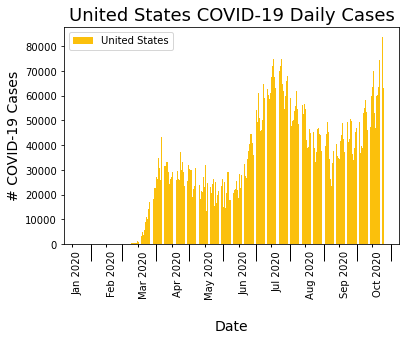
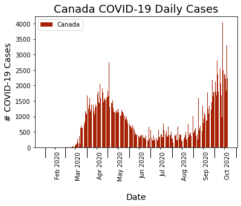
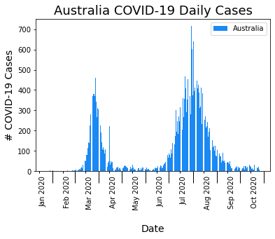
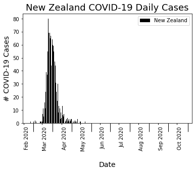
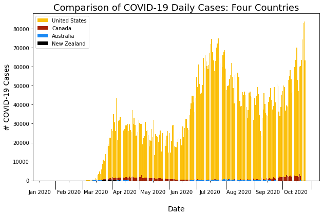
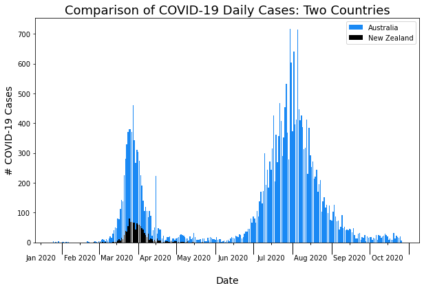

# Capstone_1
# Project Question/Goal

# Background + Motivation

# Description Raw Data
show list of columns & datatype --> so that way can show what I paired it down to
(might take away more columns again)
link to sources for data, how many data points (rows) etc

# Exploratory Data Analysis

After creating cleaned dataframes for each country's COVID-19 data, I started exploring the data by looking at  daily case incidence. I created a bar plot function to plot the daily case counts over the past ten months of the pandemic. I plotted each country separately at first:

 

    
  

Upon initial analysis of the y-axis (number of COVID-19 cases) it was clear the United States has an overwhelmingly larger amount of COVID-19 cases compared to Canada, Australia and New Zealand. I then wanted to see how the countries compared to each other. I plotted all four together, but due to the United States' highest daily count around 80,000 cases it was hard to see the other three countries data. 

  

**Fig 1: Comparing COVID-19 Daily Case Incidence: Comparing United States, Canada, Australia + New Zealand daily incidence of COVID-19 cases; major ticks are beginning and end of each month, minor ticks are the 15th of each month.**

I then plotted only Canada, Australia, and New Zealand, and again Canada had a higher maximum daily count around 4,000 cases so it was hard to see Australia and New Zealand's data. 

  

**Fig 2: Comparing COVID-19 Daily Case Incidence: Comparing Canada, Australia + New Zealand daily incidence of COVID-19 cases; major ticks are beginning and end of each month, minor ticks are the 15th of each month.**

Finally, I looked at just Australia and New Zealand's data together as they are similar countries in being islands that are cut off from land travel with similar public health and government mentalities regarding containing the pandemic.

  

**Fig 3: Comparing COVID-19 Daily Case Incidence: Comparing Australia + New Zealand daily incidence of COVID-19 cases; major ticks are beginning and end of each month, minor ticks are the 15th of each month.**

use this to go through question thought process to see how you got to final question/goal or hypothesis

# Analysis
discuss cleaning pipeline and scripts (try to put this into OOP, need if name main block)
discuss creating new database files of the cleaned data
**doing any stats?

# Future Steps

# References